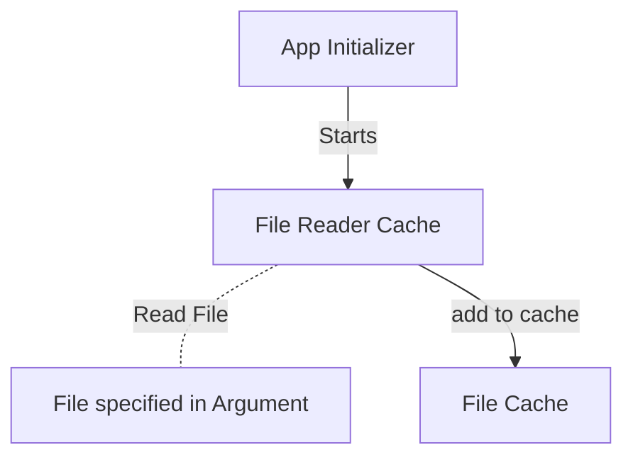

# Welcome to Line Server 

Hello! My name is **Francisco Filipe**. This file has the necessary documentation to run the **Salsify Exercise**. 

# How to run the application

### Quick run
Just run the scripts:
```
build.sh
```
And after the build is done, run the ```run.sh``` with the file name that is intended to be read and stored in memory:
```
run.sh fileName
```

Available Endpoint:
> http://localhost:8080/line/{lineNumber}

{lineNumber} is the File line number that you want to read.  

# Tech Design
#### Flow Diagram
This is a summarized Diagram of how the application works.



The class **ApplicationInitializer.java** has **`@EventListener(ApplicationReadyEvent.class)`** that is triggered after spring finished boot up.
Then this class initiates every vital part of the app:
 - FileReaderCache that reads from file and add contents to cache.

The class **FileReaderCache.java** can reload the cache, by reading the file again and stores the file content in an ArrayList.

The **ArrayList** was used, instead of any other data structure, because in the endpoit, we specify the line that we want to read, so we always have an **index** of the list, which makes it a read time complexity of O(1),

The only downsize is when reading the file, it can take a while if files start to grow in number of lines, but the read time will always be O(1).


# Questions and Considerations 

####  How will your system perform with a 1 GB file? a 10 GB file? a 100 GB file?

Java FileInputStream can be really fast reading files line by line. But when increasing the number of line in file, there will be always a decrease in performance booting up the application. After the application is running, the search time will always be O(1).

####     How will your system perform with 100 users? 10000 users? 1000000 users?

If the number of users increase dramatically, the cache mecanism **wont have much problems**, because every user will read from the list, and since they will **not modify nothing**, and the list is immutable during the life of the application, we can assume we have a thread safe environment on the cache level.

What **can really be a problem**, is the load on the endpoint provided by java spring. with the increase of the users, this enpoint will be overloaded, but there is a simple solution to this, which is **start more instances of the application**. 

Using a tool like **docker** and **kubernetes** and a simple round robin load balancer, we could scale this application  really well.


####   What documentation, websites, papers, etc did you consult in doing this assignment?

I tried to use all the knowledge i had to do this exercise. I consulted the best and fastest way to read from files, which could be the application bottleneck. If this was a real case scenario, i would try to find a better approach to the server endpoint. Spring is not the best solution for a stand alone application that has millions of users.


####   What third-party libraries or other tools does the system use? How did you choose each library or framework you used?

I am using spring boot for this exercise.


####   How long did you spend on this exercise? If you had unlimited more time to spend on this, how would you spend it and how would you prioritize each item?

I spent around 3 hours developing this solution (with scripts and documentation included). If i had unlimited amount of time i would try to find a better framework resolve the enpoints user scaling issue.
I would make a lot of tests to assure everything was working as intended.

####    If you were to critique your code, what would you have to say about it?

I always try to follow clean code rules when developing a solution, but there is always room to improve. The lack os junit testing is really my main concern here, but since it was a simple problem, the usage of manual tests where enought to check if the application had the minimum quality needed.
